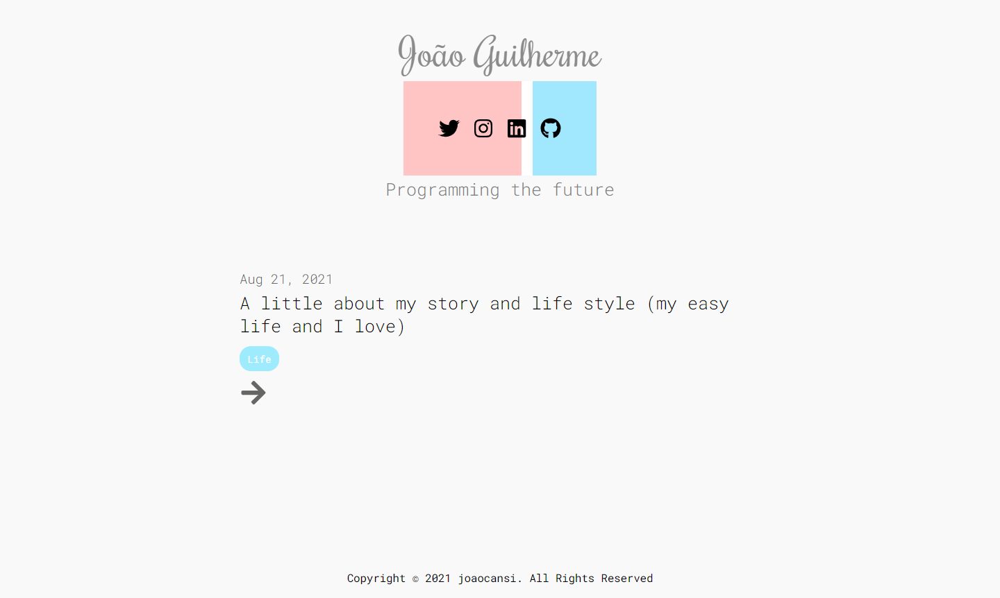

<h1 align="center">
  
</h1>

  <a href="#-techs">✨ Techs</a>&nbsp;&nbsp;&nbsp;|&nbsp;&nbsp;&nbsp;
  <a href="#-project">💻 Project</a>&nbsp;&nbsp;&nbsp;|&nbsp;&nbsp;&nbsp;
  <a href="#-layout">🔖 Layout</a>&nbsp;&nbsp;&nbsp;|&nbsp;&nbsp;&nbsp;
  <a href="#-how-to-start">🚀 How to start</a>&nbsp;&nbsp;&nbsp;

  

    

## ✨ Techs

This project was created using this following technologies:

- [Next.js](https://nextjs.org)
- [GraphCMS](https://graphcms.com)
- [React](https://reactjs.org)
- [TypeScript](https://www.typescriptlang.org)

## 💻 Project

A simple blog created by using GraphQL and Headless CMS. The posts can be created in the website that provides the Headless CMS (graphcms.com)

## 🔖 Layout

  

  

## 🚀 How to Start 

Unfortunately, the tutorial is not finished so there's no way to start at your machine without studying the code. However, if you want to access the project to see how it is working at production, here is the link: https://blog-headless-cms.netlify.app
    

